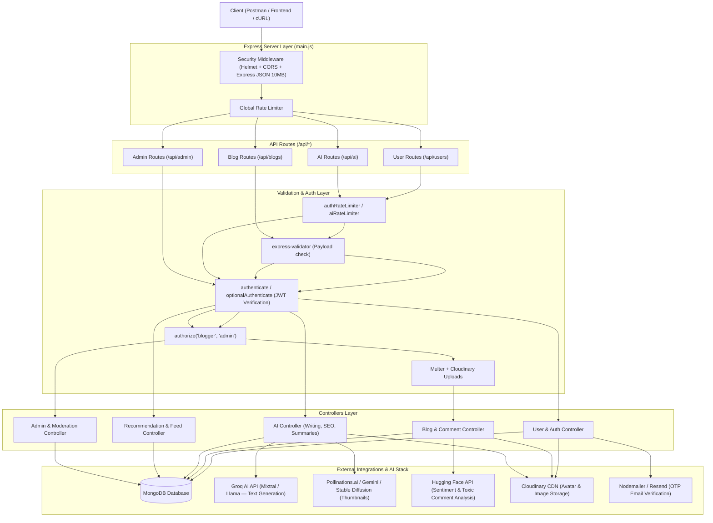

# Scriptify AI Backend — Architectural Flow & End-to-End Testing Guide

This document explains the complete architectural data flow of the **Scriptify AI Backend** and provides a chronological, end-to-end testing playbook. You can use this guide to verify every API layer, middleware, database interaction, and external AI/storage integration.

---

## 1. System Architecture & Request Lifecycle



---

## 2. Request Lifecycle Breakdown

Every incoming HTTP request through `main.js` follows these exact execution stages:

1. **Global Processing (`main.js`)**
   - **DNS Order**: Configured to `ipv4first` to prevent latency in cloud environments.
   - **Security**: `helmet()` secures HTTP headers with a tailored Content Security Policy allowing Swagger docs inline resources and OAuth origins.
   - **Body Parsing**: `express.json({ limit: "10mb" })` parses JSON payloads and base64/file upload strings.
   - **Global Rate Limit**: Blocks abusive traffic before hitting specific route handlers.

2. **Route Resolution (`/route/*`)**
   - Requests are routed to four core modules:
     - `/api/users`: Authentication, profile management, bookmarks, follow systems, Google OAuth.
     - `/api/blogs`: Blog CRUD, status filtering, comments, like toggles.
     - `/api/ai`: AI text generation, summarization, SEO tags, title generation, sentiment analysis, personalized feed recommendations.
     - `/api/admin`: Dashboard metrics, comment moderation, user suspension, role management, blog featuring.

3. **Validation & Authorization Pipeline (`/middleware/*`)**
   - **Rate Limiters**: Specialized thresholds (`authRateLimiter` on login/signup, `aiRateLimiter` on AI endpoints).
   - **Input Validation**: `express-validator` checks rules (e.g. valid emails, required lengths) and rejects invalid payloads with `400 Bad Request`.
   - **JWT Authentication (`authenticate`)**: Verifies `Bearer <accessToken>` and injects `req.user`.
   - **Role Authorization (`authorize(...)`)**: Verifies `req.user.role` matches allowed roles (`blogger`, `admin`).
   - **File Uploads (`uploadThumbnail` / `uploadAvatar`)**: Intercepts `multipart/form-data`, buffers files via Multer, streams to Cloudinary, and attaches `req.cloudinaryUrl`.

---

## 3. End-to-End Testing Chronology

Follow this exact 5-phase testing sequence to test the entire system seamlessly from end to end.

> [!NOTE]
> In Development (`NODE_ENV !== "production"`), the 6-digit email verification OTP is logged directly to your server console (`[DEV] OTP for <email>: <otp>`), allowing you to test without waiting for SMTP emails.

### Phase 1: User Onboarding & Auth Flow

1. **Register a User (`POST /api/users/signup`)**
   - Creates a user with `role: "reader"` (or `"blogger"` if specified) and sends a verification OTP.
   - *If the email matches `ADMIN_EMAIL` in `.env`, the backend automatically grants `role: "admin"`.*
2. **Verify Email (`POST /api/users/verify-email`)**
   - Activates the account (`isVerified: true`). Unverified accounts cannot log in.
3. **Sign In (`POST /api/users/signin`)**
   - Returns short-lived `accessToken` (default 15m) and long-lived `refreshToken` (default 7d).
4. **Refresh Access Token (`POST /api/users/refresh-token`)**
   - Rotates refresh tokens and issues a fresh `accessToken`.
5. **Update User Profile (`PUT /api/users/profile`)**
   - Updates `firstName`, `lastName`, `bio`, `preferredCategories`, and optionally uploads a profile avatar.

### Phase 2: Blog Publishing & Interaction Flow

1. **Create a Blog Post (`POST /api/blogs`)**
   - **Requirement**: Must be signed in as a user with `role: "blogger"` or `"admin"`.
   - Accepts `title`, `content`, `tags`, `status: "published"`, and an optional image file.
2. **Fetch Blog Post (`GET /api/blogs/:id`)**
   - Reads blog details and automatically increments `views` count.
3. **Like / Unlike Blog (`POST /api/blogs/:id/like`)**
   - Toggles like state and updates `likesCount`.
4. **Bookmark Blog (`POST /api/users/bookmarks/:blogId`)**
   - Adds the blog to `req.user.bookmarks`. Verify via `GET /api/users/me/bookmarks`.
5. **Add Comment (`POST /api/blogs/:id/comments`)**
   - Automatically runs sentiment analysis via Hugging Face.
   - If the comment is flagged as `TOXIC`, `isApproved` is set to `false` and it is sent to admin moderation queue.

### Phase 3: AI Assistant Suite Flow

Test all 6 AI modules powered by Groq API, Pollinations/Gemini, and Hugging Face:

1. **Generate Blog Draft (`POST /api/ai/generate-draft`)**
   - Input topic & tone -> Returns complete structured JSON draft (`title`, `introduction`, `sections`, `conclusion`, `suggestedTags`).
2. **Generate Catchy Titles (`POST /api/ai/generate-titles`)**
   - Input topic -> Returns an array of 5 SEO-optimized titles.
3. **Generate SEO Metadata (`POST /api/ai/generate-seo-tags`)**
   - Input title/content -> Returns `tags`, `seoKeywords`, `metaDescription`, and `category`.
4. **Improve Content Grammar & Tone (`POST /api/ai/improve-content`)**
   - Polishes raw or draft text into professional editorial copy.
5. **Summarize Blog Post (`POST /api/ai/summarize`)**
   - Input `blogId` or raw `content` -> Returns concise summary and key points.
6. **Generate AI Thumbnail (`POST /api/ai/generate-thumbnail`)**
   - Generates an image via Pollinations.ai / Gemini, saves to Cloudinary, and optionally attaches it to `blogId`.
7. **Analyze Comment Sentiment (`POST /api/ai/analyze-sentiment`)**
   - Classifies text sentiment (`positive`, `negative`, `neutral`, or `TOXIC`).

### Phase 4: Recommendation & Personalization Flow

1. **Log Reading Duration (`POST /api/ai/recommendations/reading-duration`)**
   - Send `{ "blogId": "<id>", "duration": 120 }` to feed interaction history.
2. **Fetch Personalized Feed (`GET /api/ai/recommendations/feed`)**
   - Returns customized blog feed scored based on user interaction tags and preferred categories.
3. **Fetch Trending & Similar Blogs (`GET /api/ai/recommendations/trending` & `GET /api/ai/recommendations/similar/:blogId`)**
   - Public recommendation endpoints.

### Phase 5: Admin & Moderation Flow

1. **Sign in as Admin (`POST /api/users/signin`)**
   - Use account matching `ADMIN_EMAIL` configured in `.env`.
2. **Dashboard Metrics (`GET /api/admin/dashboard`)**
   - Inspect total users, total blogs, flagged comments, and daily growth counts.
3. **Review Flagged Comments (`GET /api/admin/comments/flagged`)**
   - Lists comments marked toxic by sentiment AI.
4. **Moderate Comment (`PATCH /api/admin/comments/:commentId/moderate`)**
   - Send `{ "action": "approve" }` or `{ "action": "remove" }`.
5. **Feature a Blog (`PATCH /api/admin/blogs/:id/feature`)**
   - Toggles `isFeatured: true` for homepage spotlighting.

---

## 4. Complete Ready-to-Run cURL Commands

You can run these cURL commands against `http://localhost:5000` (or your configured `PORT`). Replace `<TOKEN>`, `<USER_ID>`, and `<BLOG_ID>` with actual values from previous step responses.

### A. Health & Swagger Docs
```bash
# Health check
curl -X GET http://localhost:5000/api/health

# Open API specification JSON
curl -X GET http://localhost:5000/api/docs.json
```

### B. User Registration & Email Verification
```bash
# 1. Sign Up as a Blogger
curl -X POST http://localhost:5000/api/users/signup \
  -H "Content-Type: application/json" \
  -d '{
    "firstName": "Rizwan",
    "lastName": "Bashir",
    "email": "rizwan.blogger@example.com",
    "mobile": "+923001234567",
    "password": "Password@123",
    "role": "blogger"
  }'

# 2. Verify Email (check backend terminal log for [DEV] OTP)
curl -X POST http://localhost:5000/api/users/verify-email \
  -H "Content-Type: application/json" \
  -d '{
    "email": "rizwan.blogger@example.com",
    "otp": "123456"
  }'

# 3. Sign In
curl -X POST http://localhost:5000/api/users/signin \
  -H "Content-Type: application/json" \
  -d '{
    "email": "rizwan.blogger@example.com",
    "password": "Password@123"
  }'
```

### C. Creating & Interacting with Blogs
```bash
# 4. Create a Blog (Requires accessToken)
curl -X POST http://localhost:5000/api/blogs \
  -H "Authorization: Bearer <TOKEN>" \
  -F "title=The Future of Agentic AI in 2026" \
  -F "content=Agentic AI systems are revolutionizing software development by reasoning and executing complex workflows autonomously." \
  -F 'tags=["AI","Agentic","Technology"]' \
  -F "status=published"

# 5. Get All Published Blogs
curl -X GET "http://localhost:5000/api/blogs?page=1&limit=10"

# 6. Like a Blog
curl -X POST http://localhost:5000/api/blogs/<BLOG_ID>/like \
  -H "Authorization: Bearer <TOKEN>"

# 7. Add a Comment to Blog
curl -X POST http://localhost:5000/api/blogs/<BLOG_ID>/comments \
  -H "Authorization: Bearer <TOKEN>" \
  -H "Content-Type: application/json" \
  -d '{"text": "Extremely insightful article on Agentic AI workflows!"}'
```

### D. Testing AI Features
```bash
# 8. Generate Blog Draft (Groq Mixtral/Llama)
curl -X POST http://localhost:5000/api/ai/generate-draft \
  -H "Authorization: Bearer <TOKEN>" \
  -H "Content-Type: application/json" \
  -d '{
    "topic": "Neural Networks for Web Developers",
    "tone": "professional",
    "wordCount": 600
  }'

# 9. Generate SEO Tags & Meta Description
curl -X POST http://localhost:5000/api/ai/generate-seo-tags \
  -H "Authorization: Bearer <TOKEN>" \
  -H "Content-Type: application/json" \
  -d '{
    "title": "Neural Networks for Web Developers",
    "content": "An introductory guide explaining how deep learning models integrate into modern JavaScript web applications."
  }'

# 10. Generate Catchy Titles
curl -X POST http://localhost:5000/api/ai/generate-titles \
  -H "Authorization: Bearer <TOKEN>" \
  -H "Content-Type: application/json" \
  -d '{"topic": "Building AI-Powered APIs with Express and Node.js"}'

# 11. Generate AI Thumbnail
curl -X POST http://localhost:5000/api/ai/generate-thumbnail \
  -H "Authorization: Bearer <TOKEN>" \
  -H "Content-Type: application/json" \
  -d '{
    "title": "Neural Networks for Web Developers",
    "prompt": "Futuristic glowing neural network interconnected nodes over a sleek dark indigo backdrop, clean digital art"
  }'
```

### E. Admin Capabilities
```bash
# 12. Check Admin Dashboard Stats (Requires Admin accessToken)
curl -X GET http://localhost:5000/api/admin/dashboard \
  -H "Authorization: Bearer <ADMIN_TOKEN>"

# 13. Feature a Blog Post
curl -X PATCH http://localhost:5000/api/admin/blogs/<BLOG_ID>/feature \
  -H "Authorization: Bearer <ADMIN_TOKEN>"
```

---

## 5. Environment Reference (`.env`)

Ensure your `/home/rizzzwan-bashir/scriptify-ai/Backend/.env` contains the following keys for full end-to-end operation:

```env
PORT=5000
NODE_ENV=development
CLIENT_URL=http://localhost:5173

# Database
MONGO_URI=mongodb://127.0.0.1:27017/scriptify-ai

# Security & Tokens
JWT_SECRET=your_jwt_access_secret_key
JWT_REFRESH_SECRET=your_jwt_refresh_secret_key
JWT_EXPIRES_IN=15m
JWT_REFRESH_EXPIRES_IN=7d

# Admin Automatic Promotion
ADMIN_EMAIL=admin@scriptify.ai

# AI Keys
GROQ_API_KEY=gsk_your_groq_api_key_here
HUGGINGFACE_API_KEY=hf_your_huggingface_key_optional

# Cloudinary Storage
CLOUDINARY_CLOUD_NAME=your_cloud_name
CLOUDINARY_API_KEY=your_api_key
CLOUDINARY_API_SECRET=your_api_secret
```
